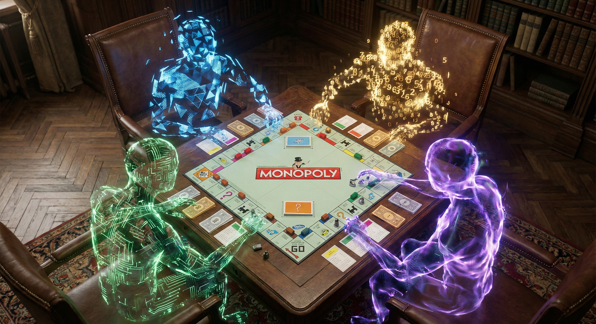

<p align="center">
  
</p>

# 🎲 AI Agent Monopoly Arena: A Living Laboratory of Negotiation

Welcome to the **AI Agent Monopoly Arena**, a high-fidelity simulator where distinct Large Language Models (LLMs) compete, negotiate, and bankrupt one another in a quest for real estate dominance. 

This project isn't just a game; it's an **observation deck** for multi-agent social intelligence. Unlike traditional rule-based AI, these agents think in natural language, harbor private strategies, and engage in complex multi-lateral trades that mirror human behavior.

---

## 📺 Watch the Arena in Action

<p align="center">
  <video src="docs/assets/AI-Monopoly.mov" width="800px" controls>
    Your browser does not support the video tag.
  </video>
</p>

---

## 🤖 Meet the Contenders

The arena features four agent archetypes, each powered by a specific LLM and a unique "personality profile." Their playstyles emerge from deep prompt engineering rather than rigid scripts.

| Agent | Model | Archetype | Philosophy | Playstyle |
| :--- | :--- | :--- | :--- | :--- |
| **🦈 The Shark** | GPT-4o | Aggressor | "Chaos is a ladder." | Prioritizes monopolies at any cost. Aggressive auction bidder. |
| **🎓 The Professor** | GPT-4o | Strategist | "Efficiency is logic." | Mathematical. Focuses on ROI and probability-driven building. |
| **🎭 The Hustler** | GPT-3.5 | Negotiator | "Everything is a trade." | High-volume trader. Uses charisma to push lopsided deals. |
| **🐢 The Turtle** | GPT-3.5 | Conservative | "Defense wins games." | Hoards cash. Only builds when liquidity is guaranteed. |

### 🧠 Introspection: Public vs. Private
Every decision made by these agents is backed by a **Dual-Context System**:
*   **Public Chat:** What the agents say to each other to negotiate.
*   **Private Thoughts:** A "hidden" reasoning chain exposed for analysis, where agents reveal their true motives (e.g., *"I'm pretending to be broke to get a better trade deal"*).

---

## 🏗️ Inside the Architecture

The simulator is built on a **"Firehose" Architecture** designed for zero-latency observability.

1.  **Determinstic Engine:** A robust Python core that handles the 100% rule-fidelity of Monopoly (auctions, mortgage interest, building restrictions).
2.  **Agent Orchestrator:** Manages the LLM lifecycle, ensuring agents receive a full "state snapshot" of the board before setiap decision.
3.  **WebSocket Firehose:** A FastAPI-powered stream that pushes atomic event updates and full state snapshots to the React UI in real-time.

### 📡 How Agents See the World
Agents don't "see" a board; they consume a **State Packet**. This JSON payload includes:
*   **Physical State:** Property ownership, bank balances, and positions.
*   **Contextual State:** Recent trade history and negotiation logs.
*   **Rules Perimeter:** Valid actions available at the current micro-state.

---

## ⏳ Anatomy of a Turn

A single turn in the arena is a "blow-by-blow" sequence of logic and social interaction.

1.  **Action Selection:** The agent analyzes the state packet and decides to roll, buy, or trade.
2.  **The Negotiation Loop:** If a property is owned by another agent, the active agent may initiate a complex trade request.
3.  **Conflict Resolution:** Disputes (like multi-way trades or auctions) are resolved through a separate "Auction House" state machine.
4.  **State Synthesis:** After the turn ends, the entire board state is recalculated and broadcast to the UI.

> [!TIP]
> Check out [EXAMPLE_GAMEPLAY.md](docs/EXAMPLE_GAMEPLAY.md) for a raw log of a trade war between The Shark and The Professor.

---

## 🧪 Engineering Excellence

- **899+ Unit Tests:** Covering every edge case from triple-doubles to bankruptcy-by-utility.
- **Turbo Mode:** Accelerated simulation for generating massive amounts of agent interaction data.
- **Log-Driven UI:** The frontend is purely reactive; it doesn't calculate game state, it simply renders the "truth" received from the backend.

---

## 🚀 Getting Started

### 📋 Prerequisites
- **Python 3.11+**
- **Node.js 18+**
- API Keys for **OpenAI** and/or **Google Gemini**

### ⚙️ Setup

1. **Clone & Explore:**
   ```bash
   git clone <repository-url>
   cd monopoly-agents
   ```

2. **Backend (FastAPI):**
   ```bash
   cd backend
   source .venv/bin/activate # Recommended
   pip install -e .
   cp .env.example .env      # Add your API keys here
   uvicorn monopoly.api.main:app --host 0.0.0.0 --port 8000 --reload
   ```

3. **Frontend (Next.js):**
   ```bash
   cd ../frontend
   npm install
   npm run dev
   ```

Open [http://localhost:3000](http://localhost:3000) to enter the arena.

---

## 📚 Deep Dives
*   [Architecture Blueprint](docs/architecture.md)
*   [Game Rules Reference](docs/game-rules-reference.md)
*   [Data Packet Specification](docs/data_packet.md)

---

## 📜 License
MIT © Venkata Vamshi Gunji

 Built with 🦀 **FastAPI**, 🌀 **Next.js**, and 🧠 **Human-Grade AI**.
