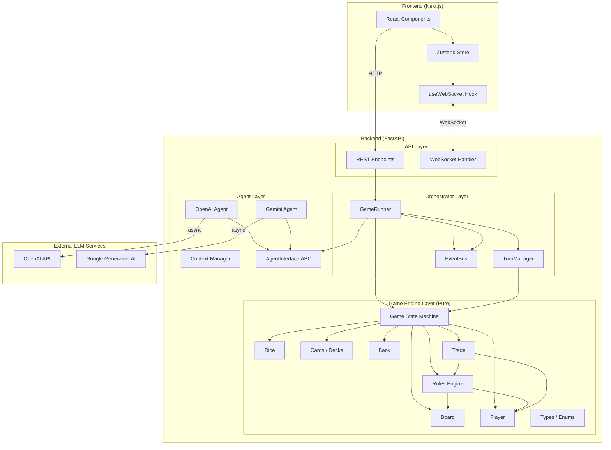
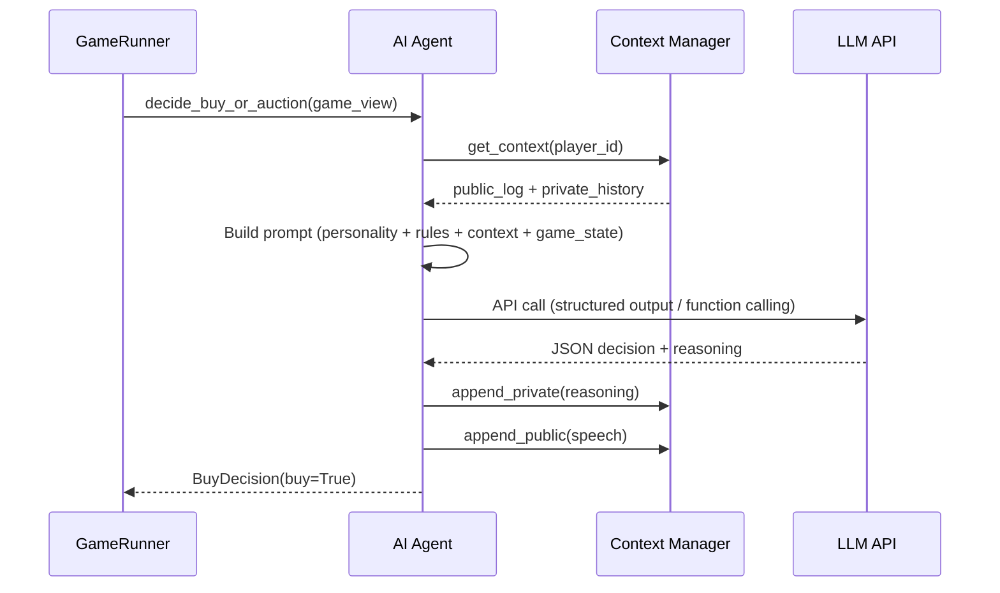
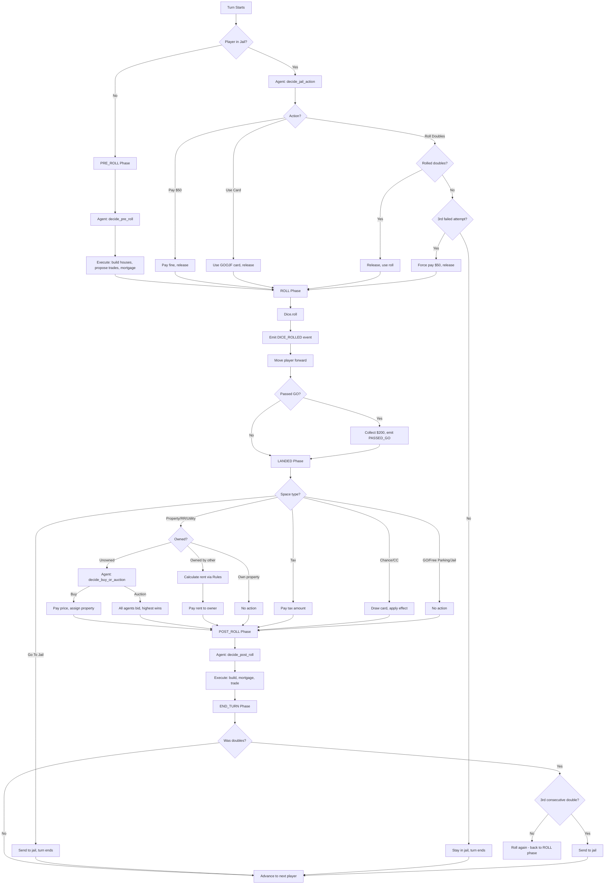
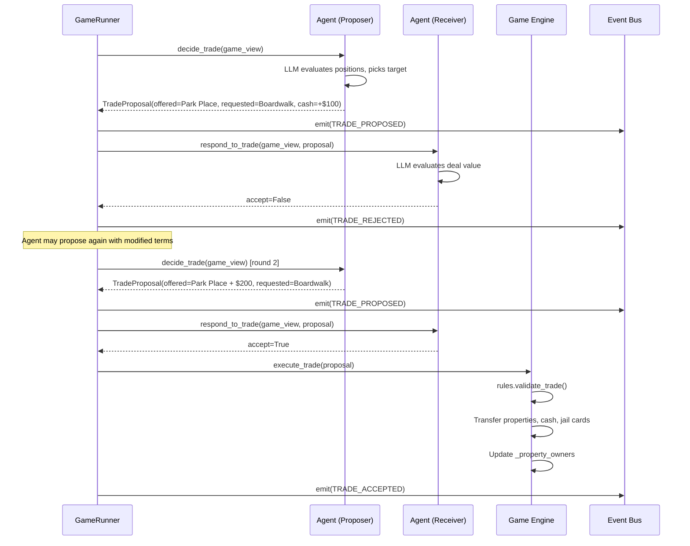
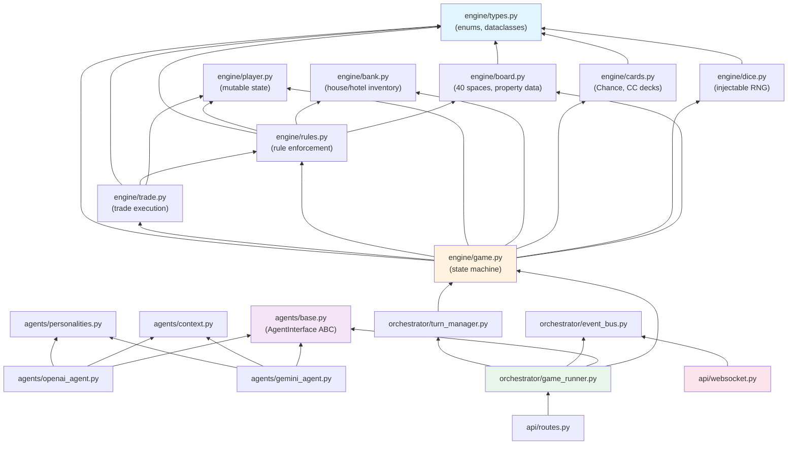

# Monopoly AI Agents -- Architecture Document

> **Version**: 1.0
> **Last Updated**: 2026-02-11
> **Status**: Sprint 1 complete (Game Engine), Sprints 2-5 planned

---

## Table of Contents

1. [System Overview](#1-system-overview)
2. [Architecture Diagram](#2-architecture-diagram)
3. [Layer Descriptions](#3-layer-descriptions)
4. [Data Flow](#4-data-flow)
5. [Component Diagram](#5-component-diagram)
6. [Technology Stack](#6-technology-stack)
7. [Key Design Decisions](#7-key-design-decisions)

---

## 1. System Overview

### Purpose

Monopoly AI Agents is a simulation platform where **4 AI agents**, each powered by a different LLM provider and embodying a distinct personality, play a complete game of Monopoly against each other. The system allows observers to watch AI agents negotiate, strategize, bluff, and make decisions in real time through a web-based frontend.

### High-Level Description

The system consists of three major subsystems connected via WebSocket and REST:

| Subsystem | Technology | Role |
|-----------|-----------|------|
| **Backend** | Python 3.11+, FastAPI | Game engine, AI agent coordination, event streaming |
| **Frontend** | Next.js, React, TypeScript | Real-time game visualization, agent conversation display |
| **LLM Services** | OpenAI API, Google Generative AI API | Decision-making for each AI agent |

The backend follows a strict **3-layer architecture**: a pure deterministic Game Engine at the core, an Agent Layer wrapping LLM providers, and an Orchestrator Layer coordinating the game loop. The frontend consumes a stream of game events over WebSocket and renders the board, agent conversations, private reasoning, and game log.

### Players

| Agent | Name | LLM Provider | Model | Personality |
|-------|------|-------------|-------|-------------|
| 1 | The Shark | OpenAI | GPT-4o | Aggressive negotiator, buys everything, intimidates |
| 2 | The Professor | Google | Gemini Pro | Analytical strategist, calculates expected values |
| 3 | The Hustler | OpenAI | GPT-4o-mini | Charismatic bluffer, makes bad deals sound great |
| 4 | The Turtle | Google | Gemini Flash | Conservative builder, hoards cash, avoids risk |

---

## 2. Architecture Diagram

### System-Level Architecture (ASCII)

```
+----------------------------------------------------------------------+
|                           FRONTEND                                    |
|  Next.js + React + TypeScript + Tailwind CSS + Zustand               |
|                                                                       |
|  +------------+  +------------------+  +-----------+  +----------+   |
|  | GameBoard  |  | ConversationPanel|  |ThoughtPanel|  | GameLog  |   |
|  | (board viz)|  | (public chat)    |  |(private)   |  | (events) |   |
|  +------+-----+  +--------+---------+  +-----+-----+  +-----+----+   |
|         |                  |                  |              |         |
|         +----------+-------+------------------+--------------+        |
|                    |                                                   |
|              +-----v------+                                           |
|              | Zustand     |                                          |
|              | Game Store  |                                          |
|              +-----+------+                                           |
|                    |                                                   |
|              +-----v--------+                                         |
|              | useWebSocket |                                         |
|              +-----+--------+                                         |
+--------------------|-------------------------------------------------+
                     | WebSocket (ws://host/ws/game/{id})
                     | REST (http://host/api/game/*)
+--------------------|-------------------------------------------------+
|                    v          BACKEND (FastAPI)                        |
|  +----------------------------------------------------------------------+
|  |                      API LAYER                                       |
|  |  +-----------------+    +------------------+                         |
|  |  | REST Endpoints  |    | WebSocket Handler|                         |
|  |  | (routes.py)     |    | (websocket.py)   |                         |
|  |  +--------+--------+    +--------+---------+                         |
|  +-----------|------------------------|---------------------------------+
|              |                        |
|  +-----------|------------------------|---------------------------------+
|  |           v        ORCHESTRATOR LAYER           v                    |
|  |  +------------------+  +--------------+  +--------------+           |
|  |  | GameRunner       |  | TurnManager  |  | EventBus     |           |
|  |  | (game_runner.py) |  | (turn_mgr.py)|  | (event_bus.py)|          |
|  |  +--------+---------+  +------+-------+  +------+-------+          |
|  +-----------|---------------------|-----------------|-----------------+
|              |                     |                 |
|  +-----------|---------------------|-----------------|-----------------+
|  |           v         AGENT LAYER v                 |                  |
|  |  +-------------+  +----------------+  +-----------v---+             |
|  |  | OpenAI Agent|  | Gemini Agent   |  | Context Mgr   |            |
|  |  | (GPT-4o,    |  | (Pro, Flash)   |  | (public/      |            |
|  |  |  4o-mini)   |  |                |  |  private)     |            |
|  |  +------+------+  +-------+--------+  +---------------+            |
|  |         |                  |                                        |
|  |  +------v------------------v--------+                               |
|  |  |       AgentInterface (ABC)       |                               |
|  |  |  decide_pre_roll()               |                               |
|  |  |  decide_buy_or_auction()         |                               |
|  |  |  decide_trade()                  |                               |
|  |  |  respond_to_trade()              |                               |
|  |  |  decide_jail_action()            |                               |
|  |  +----------------------------------+                               |
|  +---------------------------------------------------------------------+
|              |
|  +-----------v---------------------------------------------------------+
|  |                      GAME ENGINE LAYER                               |
|  |  Pure Python -- zero I/O, zero async, deterministic                  |
|  |                                                                       |
|  |  +--------+  +--------+  +-------+  +-------+  +------+  +------+  |
|  |  | types  |  | board  |  | dice  |  | player|  | cards |  | bank |  |
|  |  +--------+  +--------+  +-------+  +-------+  +------+  +------+  |
|  |                                                                       |
|  |  +--------+  +--------+  +--------+                                  |
|  |  | rules  |  | trade  |  |  game  | <-- state machine                |
|  |  +--------+  +--------+  +--------+                                  |
|  +----------------------------------------------------------------------+
+----------------------------------------------------------------------+
                     |                           |
          +----------v-----------+   +-----------v----------+
          |   OpenAI API         |   |  Google Generative   |
          |   (GPT-4o, 4o-mini) |   |  AI API              |
          |                      |   |  (Gemini Pro, Flash) |
          +----------------------+   +----------------------+
```

### Mermaid: System Architecture



### Mermaid: LLM Call Flow



---

## 3. Layer Descriptions

### 3.1 Game Engine Layer

**Location**: `backend/src/monopoly/engine/`

The Game Engine is the foundational layer. It is **pure, deterministic, and has zero I/O**. It performs no network calls, no file reads, no async operations. All randomness flows through an injectable `random.Random` instance seeded at construction time, making every game fully reproducible given the same seed.

| Module | Responsibility | Key Classes/Functions |
|--------|---------------|----------------------|
| `types.py` | Core type definitions shared across all modules | `SpaceType`, `ColorGroup`, `CardEffectType`, `JailAction`, `TurnPhase`, `GamePhase`, `PropertyData`, `RailroadData`, `UtilityData`, `Space`, `CardEffect`, `Card`, `DiceRoll`, `TradeProposal`, `EventType`, `GameEvent` |
| `board.py` | Static board layout (all 40 spaces), property data, rent tables, color group mappings | `Board`, `PROPERTIES`, `RAILROADS`, `UTILITIES`, `COLOR_GROUP_POSITIONS` |
| `dice.py` | Two six-sided dice with injectable RNG seed | `Dice` |
| `player.py` | Mutable player state: cash, position, properties, houses, jail status, bankruptcy | `Player` |
| `cards.py` | Chance (16 cards) and Community Chest (16 cards) decks with shuffle and draw logic, Get Out of Jail Free card retention | `Deck`, `create_chance_deck()`, `create_community_chest_deck()` |
| `bank.py` | House/hotel inventory management (32 houses, 12 hotels), shortage tracking | `Bank` |
| `rules.py` | Stateless rule enforcement: rent calculation, even-build rule, monopoly detection, mortgage validation, trade validation | `Rules` |
| `trade.py` | Trade execution: property transfer, cash transfer, jail card transfer, mortgaged property fee handling | `execute_trade()` |
| `game.py` | Central state machine: turn phases, dice rolling, movement, landing processing, card effects, buying/auctioning, building, mortgaging, bankruptcy, event emission | `Game`, `LandingResult` |

**Key characteristics**:
- All state is held in plain Python dataclasses (`@dataclass`)
- Frozen dataclasses (`@dataclass(frozen=True)`) for immutable reference data (`PropertyData`, `Space`, `DiceRoll`)
- Mutable dataclasses for evolving state (`Player`, `Bank`, `Game`)
- Event sourcing: every state mutation emits a `GameEvent` appended to `Game.events`
- No external dependencies beyond the Python standard library

### 3.2 Agent Layer

**Location**: `backend/src/monopoly/agents/` (planned, Sprint 2)

The Agent Layer provides the interface between the deterministic game engine and non-deterministic LLM decision-making. Each agent implements the same abstract interface but uses a different LLM backend and personality prompt.

| Module | Responsibility |
|--------|---------------|
| `base.py` | `AgentInterface` abstract base class defining all decision points |
| `openai_agent.py` | OpenAI SDK adapter (GPT-4o, GPT-4o-mini), structured output via function calling |
| `gemini_agent.py` | Google Generative AI SDK adapter (Gemini Pro, Gemini Flash) |
| `personalities.py` | System prompt templates for The Shark, The Professor, The Hustler, The Turtle |
| `context.py` | Public/private context separation, context window management, history summarization |

**AgentInterface contract** (all methods are `async`):

```python
class AgentInterface(ABC):
    async def decide_pre_roll(game_view) -> PreRollAction
    async def decide_buy_or_auction(game_view, property) -> bool
    async def decide_auction_bid(game_view, property, current_bid) -> int
    async def decide_trade(game_view) -> Optional[TradeProposal]
    async def respond_to_trade(game_view, proposal) -> bool
    async def decide_jail_action(game_view) -> JailAction
    async def decide_post_roll(game_view) -> PostRollAction
```

**`GameView`**: A filtered projection of `GameState` that shows only information a player should know -- their own full state plus public information about other players (position, property count, cash). Private information like other players' strategy is not exposed.

**Context management**:
- **Public context**: Append-only log of all agent "speech" (negotiations, taunts, reactions). Visible to all agents and the frontend.
- **Private context**: Per-agent reasoning chain. Only visible when observing that agent's thought panel in the UI. Includes strategy assessment, property valuation, and opponent modeling.
- Context windows are managed to stay within LLM token limits by summarizing older history.

### 3.3 Orchestrator Layer

**Location**: `backend/src/monopoly/orchestrator/` (planned, Sprint 3)

The Orchestrator Layer coordinates the game loop, managing the interplay between the pure game engine and the async AI agents.

| Module | Responsibility |
|--------|---------------|
| `game_runner.py` | Main game loop: initializes game + agents, runs turns until completion |
| `turn_manager.py` | Turn sequencing, doubles handling (roll again / jail on 3rd), negotiation rounds, time limits on agent decisions, bankruptcy resolution |
| `event_bus.py` | Event broadcasting: subscribes WebSocket consumers, fans out `GameEvent` objects |

**GameRunner lifecycle**:

```
GameRunner.__init__(agents, seed)
    |
    v
GameRunner.run_game(max_turns=1000)
    |
    +---> while not game.is_over():
    |         |
    |         +---> run_turn()
    |                   |
    |                   +---> PRE_ROLL: agent.decide_pre_roll()
    |                   +---> ROLL: game.roll_dice() + game.move_player()
    |                   +---> LANDED: game.process_landing() + agent decision if needed
    |                   +---> POST_ROLL: agent.decide_post_roll()
    |                   +---> END_TURN: handle doubles / advance turn
    |
    v
GameOver event emitted
```

**Event Bus pattern**:
- The event bus uses a publish-subscribe model
- Game engine emits events to the event list
- Orchestrator forwards events to the event bus after each action
- WebSocket handler subscribes to the event bus and streams events to connected frontend clients
- Multiple WebSocket connections can observe the same game simultaneously

### 3.4 API Layer

**Location**: `backend/src/monopoly/api/` (planned, Sprint 3)

The API Layer exposes the game to the outside world through two communication channels:

**REST endpoints** (`routes.py`):

| Method | Path | Purpose |
|--------|------|---------|
| `POST` | `/api/game/start` | Start a new game, returns `game_id` |
| `GET` | `/api/game/{id}/state` | Get current game state snapshot |
| `GET` | `/api/game/{id}/history` | Get full event history |
| `POST` | `/api/game/{id}/pause` | Pause the game loop |
| `POST` | `/api/game/{id}/resume` | Resume the game loop |
| `POST` | `/api/game/{id}/speed` | Set delay between turns (0.5x - 5x) |
| `GET` | `/api/game/{id}/agents` | Get agent info (names, personalities, models) |

**WebSocket** (`websocket.py`):

| Path | Purpose |
|------|---------|
| `WS /ws/game/{id}` | Real-time event stream for a game |

Events are streamed as JSON:

```json
{
  "event": "dice_rolled",
  "data": {"player_id": 0, "die1": 4, "die2": 3, "total": 7, "doubles": false},
  "turn_number": 42,
  "timestamp": "2026-02-11T12:00:00Z"
}
```

```json
{
  "event": "agent_spoke",
  "data": {"player_id": 1, "message": "I'll give you Baltic for Oriental + $50. Deal?"},
  "turn_number": 42,
  "timestamp": "2026-02-11T12:00:01Z"
}
```

```json
{
  "event": "agent_thought",
  "data": {"player_id": 1, "thought": "Baltic is worth less, but I need the brown monopoly..."},
  "turn_number": 42,
  "timestamp": "2026-02-11T12:00:01Z"
}
```

### 3.5 Frontend Layer

**Location**: `frontend/src/` (planned, Sprint 4)

The frontend is a Next.js application that consumes WebSocket events and renders the game in real time. All state flows **one direction**: Backend --> WebSocket --> Zustand Store --> React Components.

**Key components**:

| Component | Purpose |
|-----------|---------|
| `GameBoard.tsx` | CSS Grid-based Monopoly board with color-coded properties and player tokens |
| `BoardSpace.tsx` | Individual space rendering with ownership indicators |
| `PlayerToken.tsx` | Animated token positions on the board |
| `AgentCard.tsx` | Per-agent card: name, personality badge, cash, property count, status |
| `ConversationPanel.tsx` | Scrollable chat-style feed of all public agent speech |
| `ThoughtPanel.tsx` | Dropdown to select an agent, shows their private reasoning chain |
| `GameLog.tsx` | Chronological event stream with filtering |
| `GameControls.tsx` | Start new game, pause/resume, speed slider |
| `DiceDisplay.tsx` | Dice roll visualization with animation |
| `TradeModal.tsx` | Trade proposal and negotiation visualization |

**State management**:

```
Zustand Store (gameStore.ts)
    |
    +-- players[]: { id, name, position, cash, properties, personality, ... }
    +-- board[]: { spaces with ownership, buildings }
    +-- publicChat[]: { player_id, message, timestamp }
    +-- privateThoughts: { [player_id]: message[] }
    +-- gameLog[]: { event_type, data, timestamp }
    +-- gameStatus: "waiting" | "running" | "paused" | "finished"
    +-- currentTurn: { player_id, phase, turn_number }
```

---

## 4. Data Flow

### 4.1 Turn Execution Flow

The complete lifecycle of a single player's turn:



### 4.2 Agent Decision Flow

How a single agent decision is made, from game state to executed action:

```
 GAME ENGINE                  AGENT LAYER                    LLM SERVICE
+---------------+        +--------------------+         +----------------+
|               |        |                    |         |                |
| GameState     +------->| GameView           |         |                |
| (full state)  | filter | (player-visible    |         |                |
|               |        |  subset only)      |         |                |
+---------------+        +--------+-----------+         |                |
                                  |                     |                |
                         +--------v-----------+         |                |
                         | Build LLM Prompt   |         |                |
                         |                    |         |                |
                         | 1. System prompt   |         |                |
                         |    (personality)   |         |                |
                         | 2. Rules summary   |         |                |
                         | 3. Public context  |         |                |
                         | 4. Private history |         |                |
                         | 5. Current state   |         |                |
                         | 6. Available actions|        |                |
                         +--------+-----------+         |                |
                                  |                     |                |
                                  +-------------------->| LLM API Call   |
                                  |   (structured       | (function      |
                                  |    output request)  |  calling /     |
                                  |                     |  structured    |
                                  |<--------------------+  output)       |
                                  |   JSON response:    |                |
                                  |   - decision        +----------------+
                                  |   - reasoning
                                  |   - public_speech
                                  |
                         +--------v-----------+
                         | Parse & Validate   |
                         | Response           |
                         +--------+-----------+
                                  |
                         +--------v-----------+
                         | Context Manager    |
                         | - append private   |
                         |   reasoning        |
                         | - append public    |
                         |   speech           |
                         +--------+-----------+
                                  |
                         +--------v-----------+
                         | Return typed       |
                         | decision object    |
                         | (e.g. BuyDecision, |
                         |  TradeProposal)    |
                         +--------+-----------+
                                  |
                                  v
                          BACK TO GAME ENGINE
                          (execute the action)
```

### 4.3 Event Propagation Flow

How events travel from the game engine to the user's screen:

```mermaid
flowchart LR
    A["Game Engine<br/>(game.py)"] -->|"_emit(EventType, data)"| B["Game.events<br/>(append-only list)"]
    B -->|"get_events_since(idx)"| C["Orchestrator<br/>(GameRunner)"]
    C -->|"emit(event)"| D["Event Bus<br/>(event_bus.py)"]
    D -->|"notify subscribers"| E["WebSocket Handler<br/>(websocket.py)"]
    E -->|"JSON over WS"| F["useWebSocket Hook<br/>(frontend)"]
    F -->|"dispatch"| G["Zustand Store<br/>(gameStore.ts)"]
    G -->|"selector"| H["React Components<br/>(re-render)"]
```



**Event types emitted by the engine** (defined in `types.py`):

| Category | Events |
|----------|--------|
| Game lifecycle | `GAME_STARTED`, `TURN_STARTED`, `GAME_OVER` |
| Movement | `DICE_ROLLED`, `PLAYER_MOVED`, `PASSED_GO` |
| Property | `PROPERTY_PURCHASED`, `AUCTION_STARTED`, `AUCTION_BID`, `AUCTION_WON` |
| Finance | `RENT_PAID`, `TAX_PAID` |
| Cards | `CARD_DRAWN`, `CARD_EFFECT` |
| Building | `HOUSE_BUILT`, `HOTEL_BUILT`, `BUILDING_SOLD` |
| Mortgage | `PROPERTY_MORTGAGED`, `PROPERTY_UNMORTGAGED` |
| Trading | `TRADE_PROPOSED`, `TRADE_ACCEPTED`, `TRADE_REJECTED` |
| Jail | `PLAYER_JAILED`, `PLAYER_FREED` |
| Elimination | `PLAYER_BANKRUPT` |
| Agent comms | `AGENT_SPOKE` (public), `AGENT_THOUGHT` (private) |

### 4.4 Trading / Negotiation Flow



---

## 5. Component Diagram

### 5.1 Backend Module Dependencies

```
engine/types.py
    ^   ^   ^   ^   ^   ^   ^   ^
    |   |   |   |   |   |   |   |
    |   |   |   |   |   |   |   +-- engine/game.py
    |   |   |   |   |   |   +------ engine/trade.py
    |   |   |   |   |   +---------- engine/rules.py
    |   |   |   |   +-------------- engine/cards.py
    |   |   |   +------------------ engine/bank.py (no direct import)
    |   |   +---------------------- engine/player.py (no direct import)
    |   +-------------------------- engine/dice.py
    |   +-------------------------- engine/board.py
    |
    +-- (used by all engine modules for shared enums, dataclasses, event types)

engine/board.py
    ^       ^       ^
    |       |       |
    |       |       +-- engine/game.py
    |       +---------- engine/rules.py
    +------------------ (data constants used by player.py for net_worth)

engine/dice.py
    ^
    |
    +-- engine/game.py

engine/player.py
    ^       ^       ^
    |       |       |
    |       |       +-- engine/trade.py
    |       +---------- engine/rules.py
    |       +---------- engine/game.py
    +------------------ tests/conftest.py

engine/cards.py
    ^
    |
    +-- engine/game.py

engine/bank.py
    ^       ^
    |       |
    |       +-- engine/game.py
    +---------- engine/rules.py

engine/rules.py
    ^       ^
    |       |
    |       +-- engine/trade.py
    +---------- engine/game.py

engine/trade.py
    ^
    |
    +-- engine/game.py

engine/game.py
    ^
    |
    +-- orchestrator/game_runner.py (planned)
    +-- tests/engine/test_game.py

agents/base.py (planned)
    ^       ^
    |       |
    |       +-- agents/gemini_agent.py
    +---------- agents/openai_agent.py

orchestrator/game_runner.py (planned)
    |
    +-- uses engine/game.py (Game class)
    +-- uses agents/base.py (AgentInterface)
    +-- uses orchestrator/event_bus.py (EventBus)

api/websocket.py (planned)
    |
    +-- uses orchestrator/event_bus.py (subscribes to events)
```

### 5.2 Dependency Graph (Mermaid)



### 5.3 Test Structure

```
tests/
+-- conftest.py               # Shared fixtures: board, dice(seed=42), player, game
+-- engine/
|   +-- test_board.py          # Board layout correctness, all 40 spaces
|   +-- test_dice.py           # Deterministic rolls, doubles detection
|   +-- test_player.py         # Player state mutations, movement, net worth
|   +-- test_cards.py          # All 32 card effects, deck cycling, GOOJF retention
|   +-- test_bank.py           # House/hotel inventory, shortage detection
|   +-- test_rules.py          # Rent calculation, even-build, monopoly, mortgage, trade validation
|   +-- test_trade.py          # Trade execution, mortgaged transfers, jail card trades
|   +-- test_game.py           # Full turn flow, jail logic, bankruptcy, GO salary, auctions
+-- agents/                    # (planned)
|   +-- test_context.py        # Public/private context separation
|   +-- test_agent_interface.py # Mock agents making valid decisions
+-- orchestrator/              # (planned)
|   +-- test_game_runner.py    # Full game loop with mock agents
+-- integration/               # (planned)
    +-- test_full_game.py      # End-to-end with real LLM calls (slow, optional)
```

---

## 6. Technology Stack

### Backend

| Technology | Version | Purpose |
|-----------|---------|---------|
| Python | 3.11+ | Runtime language; union types (`X \| None`), `match` statements |
| FastAPI | >= 0.115.0 | REST API framework with automatic OpenAPI docs |
| Uvicorn | >= 0.32.0 | ASGI server with WebSocket support |
| Pydantic | >= 2.9.0 | Request/response validation, serialization |
| websockets | >= 14.0 | WebSocket protocol support |
| OpenAI SDK | >= 1.50.0 | GPT-4o and GPT-4o-mini API client |
| google-generativeai | >= 0.8.0 | Gemini Pro and Gemini Flash API client |
| python-dotenv | >= 1.0.0 | Environment variable loading for API keys |

### Backend Dev Dependencies

| Technology | Version | Purpose |
|-----------|---------|---------|
| pytest | >= 8.3.0 | Test framework |
| pytest-asyncio | >= 0.24.0 | Async test support (mode: `auto`) |
| pytest-cov | >= 6.0.0 | Test coverage reporting |
| ruff | >= 0.7.0 | Linting and formatting (100 char line length, Python 3.11 target) |

### Frontend (Planned)

| Technology | Purpose |
|-----------|---------|
| Next.js | React framework with SSR, routing |
| React 18+ | UI component library |
| TypeScript | Type safety for frontend code |
| Tailwind CSS | Utility-first CSS framework |
| Zustand | Lightweight state management (single store pattern) |
| Lucide React | Icon library |

### LLM Models

| Agent | Provider | Model | Characteristics |
|-------|----------|-------|----------------|
| The Shark | OpenAI | GPT-4o | High capability, aggressive personality |
| The Professor | Google | Gemini Pro | Analytical reasoning, methodical play |
| The Hustler | OpenAI | GPT-4o-mini | Fast, cheaper, impulsive decisions |
| The Turtle | Google | Gemini Flash | Fast inference, conservative strategy |

### Communication Protocols

| Protocol | Usage | Direction |
|----------|-------|-----------|
| REST (HTTP) | Game control (start, pause, speed, state queries) | Frontend --> Backend |
| WebSocket | Real-time event streaming (game events, agent speech/thoughts) | Backend --> Frontend (bidirectional channel) |

---

## 7. Key Design Decisions

### 7.1 Pure Game Engine with Zero I/O

**Decision**: The game engine layer (`engine/`) has absolutely no I/O: no network calls, no file system access, no async code, no external dependencies.

**Rationale**:
- **Testability**: Engine tests run in milliseconds with zero setup. The entire test suite (`tests/engine/`) can execute without network, databases, or mock servers. Fixtures instantiate plain Python objects.
- **Determinism**: By injecting a seed into `Dice(seed=42)` and `Deck(seed=42)`, every game produces the same sequence of events. This enables **exact replay** from a seed + decision log.
- **Reliability**: The engine cannot fail due to network timeouts, API rate limits, or external service outages. All failures are constrained to the agent and API layers.
- **Portability**: The engine can be imported and used independently -- in a CLI, a Jupyter notebook, a different web framework, or unit tests -- without pulling in FastAPI, WebSocket, or LLM dependencies.

**Implementation**: The `Game` class takes an optional `seed: int | None` parameter. When provided, it creates `Dice(seed=seed)` and `Deck(seed=seed)` instances backed by `random.Random(seed)`. All state is plain dataclasses. Events are appended to an in-memory list (`Game.events`).

### 7.2 WebSocket over Polling for Real-Time Updates

**Decision**: Use WebSocket (`WS /ws/game/{id}`) as the primary channel for streaming game events to the frontend, rather than HTTP polling or Server-Sent Events.

**Rationale**:
- **Real-time agent conversations**: When AI agents "speak" (public context) or "think" (private context), these messages must appear with minimal latency. HTTP polling would introduce up to N seconds of delay between the agent speaking and the user seeing it.
- **High event frequency**: A single turn can emit 5-15 events (dice roll, movement, passed GO, landing, rent payment, agent speech, agent thought). Polling would require either very frequent requests (wasting resources) or batching (adding latency).
- **Bidirectional potential**: While the primary flow is backend-to-frontend, the WebSocket channel could later support commands like "request agent explanation" or "observer chat."
- **Natural fit**: FastAPI + Uvicorn have first-class WebSocket support. The frontend `useWebSocket` hook maintains a single persistent connection per game session.

**Alternative considered**: Server-Sent Events (SSE) would work for one-way streaming but lacks bidirectional capability and has less ecosystem support in the Python ASGI world.

### 7.3 Separate Agent Interface from Game Logic

**Decision**: The `AgentInterface` abstract base class defines a clean boundary between the game engine and LLM providers. The game engine knows nothing about agents; the agents know nothing about each other's implementations.

**Rationale**:
- **Provider independence**: Adding a new LLM provider (Anthropic, Cohere, local models via Ollama) requires only implementing `AgentInterface` -- no changes to the engine, orchestrator, or existing agents.
- **Testability**: The orchestrator and game runner can be tested with `MockAgent` implementations that return predetermined decisions, eliminating the cost and non-determinism of real LLM calls.
- **Personality injection**: Each agent's personality is a system prompt template, decoupled from the LLM adapter. The same personality could theoretically be run on different models for comparison.
- **Async boundary**: The game engine is synchronous; agent decisions are async (awaiting LLM API calls). The interface is the boundary where sync meets async. The orchestrator `await`s agent decisions, then calls synchronous engine methods.

**Interface design**: Each method receives a `GameView` (filtered game state) and returns a typed decision object. The agent is responsible for:
1. Building the LLM prompt (personality + context + state + available actions)
2. Making the API call
3. Parsing the structured response
4. Updating public/private context
5. Returning a validated decision

### 7.4 Event-Sourced Architecture

**Decision**: Every state mutation in the game engine emits a `GameEvent` object that is appended to an ordered, append-only event list (`Game.events`). The game's history is fully captured by its event stream.

**Rationale**:
- **Replay**: Given the same seed and the same agent decisions, the event stream can be replayed to reconstruct any point in the game. The frontend can implement "rewind" or "jump to turn N" by replaying events.
- **Debugging**: When an agent makes a surprising decision or a rule seems wrong, the full event history provides an audit trail. Each event records `event_type`, `player_id`, `data` (arbitrary dict), and `turn_number`.
- **Frontend synchronization**: The frontend can disconnect and reconnect, then call `GET /api/game/{id}/history` to fetch all events and rebuild state. The WebSocket then resumes streaming new events. No state is lost.
- **Analytics**: Post-game analysis can process the event stream to compute statistics: total rent collected, trade success rates, time in jail, property acquisition order.

**Implementation in `Game._emit()`**:
```python
def _emit(self, event_type: EventType, player_id: int = -1, data: dict | None = None) -> None:
    event = GameEvent(
        event_type=event_type,
        player_id=player_id,
        data=data or {},
        turn_number=self.turn_number,
    )
    self.events.append(event)
```

Events are lightweight dataclasses with no serialization cost at creation time. Serialization to JSON happens only at the API boundary when streaming over WebSocket.

### 7.5 Injectable Randomness for Deterministic Testing

**Decision**: All sources of randomness (dice rolls, card deck shuffling) accept an optional `seed` parameter that configures a dedicated `random.Random` instance.

**Rationale**:
- Tests can assert exact outcomes: `Dice(seed=42).roll()` always returns the same sequence.
- Games can be replayed identically for debugging.
- Different components use different RNG instances (game uses `seed`, community chest deck uses `seed + 1`) to avoid interference.

### 7.6 Frozen Dataclasses for Reference Data, Mutable for State

**Decision**: Static game data (property definitions, board spaces, dice rolls) uses `@dataclass(frozen=True)`. Evolving game state (players, bank, game) uses mutable `@dataclass`.

**Rationale**:
- Frozen dataclasses are hashable and can be used as dictionary keys or set members.
- Immutability of reference data prevents accidental corruption (e.g., modifying a property's rent during gameplay).
- Mutable state objects clearly signal where side effects occur.
- The `PropertyData`, `RailroadData`, `UtilityData`, `Space`, `CardEffect`, and `DiceRoll` types are all frozen -- they represent facts about the game that never change.

---

## Appendix A: Directory Structure

```
monopoly-agents/
+-- backend/
|   +-- pyproject.toml
|   +-- .env.example
|   +-- src/
|   |   +-- monopoly/
|   |       +-- __init__.py
|   |       +-- engine/            # IMPLEMENTED (Sprint 1)
|   |       |   +-- __init__.py
|   |       |   +-- types.py       # 15 classes: enums, dataclasses, event types
|   |       |   +-- board.py       # Board class, 40 spaces, PROPERTIES, RAILROADS, UTILITIES
|   |       |   +-- dice.py        # Dice class with injectable seed
|   |       |   +-- player.py      # Player dataclass with state mutations
|   |       |   +-- cards.py       # Deck class, 16 Chance + 16 Community Chest cards
|   |       |   +-- bank.py        # Bank: 32 houses, 12 hotels, shortage tracking
|   |       |   +-- rules.py       # Rules: rent, building, mortgage, trade validation
|   |       |   +-- trade.py       # execute_trade(): property/cash/card transfers
|   |       |   +-- game.py        # Game: state machine, turn phases, 639 lines
|   |       +-- agents/            # PLANNED (Sprint 2)
|   |       |   +-- __init__.py
|   |       |   +-- base.py
|   |       |   +-- openai_agent.py
|   |       |   +-- gemini_agent.py
|   |       |   +-- personalities.py
|   |       |   +-- context.py
|   |       +-- orchestrator/      # PLANNED (Sprint 3)
|   |       |   +-- __init__.py
|   |       |   +-- game_runner.py
|   |       |   +-- turn_manager.py
|   |       |   +-- event_bus.py
|   |       +-- api/               # PLANNED (Sprint 3)
|   |           +-- __init__.py
|   |           +-- main.py
|   |           +-- routes.py
|   |           +-- websocket.py
|   +-- tests/
|       +-- conftest.py            # Shared fixtures
|       +-- engine/                # IMPLEMENTED
|       |   +-- test_board.py
|       |   +-- test_dice.py
|       |   +-- test_player.py
|       |   +-- test_cards.py
|       |   +-- test_bank.py
|       |   +-- test_rules.py
|       |   +-- test_trade.py
|       |   +-- test_game.py
|       +-- agents/                # PLANNED
|       +-- orchestrator/          # PLANNED
|       +-- integration/           # PLANNED
+-- frontend/                      # PLANNED (Sprint 4)
+-- docs/
|   +-- game-rules-reference.md
|   +-- sprint-plan.md
|   +-- architecture.md           # THIS DOCUMENT
+-- .gitignore
+-- .env.example
+-- README.md
```

## Appendix B: Game Engine Class Summary

| Class | Module | Lines | Mutable? | Key Responsibility |
|-------|--------|-------|----------|--------------------|
| `Game` | `game.py` | ~590 | Yes | Central state machine; owns Board, Dice, Bank, Rules, Players, Decks; emits events |
| `Board` | `board.py` | ~60 | No* | 40-space layout; space lookup; nearest railroad/utility; color group queries |
| `Rules` | `rules.py` | ~280 | No | Stateless rule enforcement; rent, building, mortgage, trade validation |
| `Player` | `player.py` | ~125 | Yes | Cash, position, properties, houses, mortgaged set, jail state, bankruptcy |
| `Bank` | `bank.py` | ~65 | Yes | House (32) and hotel (12) inventory; upgrade/downgrade |
| `Dice` | `dice.py` | ~20 | Yes (RNG state) | Two d6 with injectable seed |
| `Deck` | `cards.py` | ~50 | Yes | Draw pile, reshuffle, GOOJF card tracking |

*Board is effectively immutable after construction; it holds only static data.

## Appendix C: GameEvent Schema

```python
@dataclass
class GameEvent:
    event_type: EventType     # Enum identifying the event kind
    player_id: int = -1       # Which player (-1 for game-level events)
    data: dict = {}           # Event-specific payload (varies by type)
    turn_number: int = 0      # Which turn this occurred in
```

**Example payloads by event type**:

| EventType | data fields |
|-----------|-------------|
| `DICE_ROLLED` | `die1`, `die2`, `total`, `doubles` |
| `PLAYER_MOVED` | `new_position`, `spaces_moved` or `direct_move` |
| `PASSED_GO` | `salary` (200) |
| `PROPERTY_PURCHASED` | `position`, `price`, `name` |
| `RENT_PAID` | `amount`, `to_player` |
| `TAX_PAID` | `amount`, `space` |
| `CARD_DRAWN` | `description`, `deck` |
| `HOUSE_BUILT` | `position`, `houses`, `name` |
| `HOTEL_BUILT` | `position`, `name` |
| `BUILDING_SOLD` | `position`, `refund` |
| `PROPERTY_MORTGAGED` | `position`, `value` |
| `PROPERTY_UNMORTGAGED` | `position`, `cost` |
| `AUCTION_WON` | `position`, `bid`, `name` |
| `TRADE_ACCEPTED` | `proposer_id`, `receiver_id`, `offered_properties`, `requested_properties`, `offered_cash`, `requested_cash` |
| `PLAYER_JAILED` | (empty) |
| `PLAYER_FREED` | `method` (`paid_fine`, `used_card`, `rolled_doubles`, `forced_payment`) |
| `PLAYER_BANKRUPT` | `creditor_id` (None if bankrupt to bank) |
| `TURN_STARTED` | `turn_number` |
| `AGENT_SPOKE` | `message` |
| `AGENT_THOUGHT` | `thought` |
